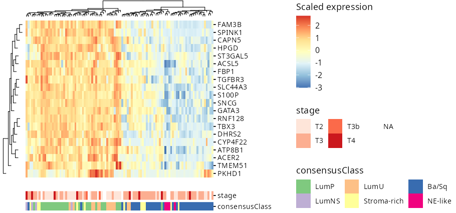

# ggheatmapper - Tile-able heatmaps using ggplot and patchwork

## Installation

```r
# install.packages("devtools")
devtools::install_github("csgroen/ggheatmapper")
```

## Key Features

- Multi‑panel support via `patchwork`: mix heatmaps, dendrograms, annotations and any `ggplot` or `grob`
- Supports semi-supervised hierarchical clustering (clustering within groups)
- Row-facetted heatmaps
- Raster for very-large heatmaps
- `ggtree` integration for hierarchical tree sidebars
- `tidyverse`‑friendly API: works with tibbles and pipes
... and more!

## Documentation

Dive deeper with the online docs:

- [Feature walkthrough](https://csgroen.github.io/ggheatmapper/articles/ggheatmapper.html)
    
- [Function reference](https://csgroen.github.io/ggheatmapper/reference/index.html)

## Hands-on example

`ggheatmapper` works with matrices:

```
library(ggheatmapper)

data(tcgaBLCA_ex)

head(tcgaBLCA_ex$gexp, 20) |>
    ggheatmap(center = TRUE, 
              scale = TRUE,
              show_colnames = FALSE,
              colors_title = "Scaled exp")
```


But *shines* with tidy data, where each column represents a variable and each row
represents and observation. 

When working with biological data (RNA-seq, single-cell, etc), often data is
stored as **genes x samples**. But this makes it challenging to include other
metadata available for samples. Here, I show how to manipulate data of this type
to plot using `ggheatmapper`:

```
library(ggheatmapper)

data(tcgaBLCA_ex)

exp_mat <- head(tcgaBLCA_ex$gexp, 20)
sample_annot <- tcgaBLCA_ex$sample_annot

exp_mat |>
    t() |>
    as.data.frame() |>
    rownames_to_column("sample") |>
    left_join(sample_annot, by = "sample") |>
    ggheatmap(
        rowv = rownames(exp_mat),
        colv = "sample",
        scale = TRUE,
        center = TRUE,
        colors_title = "Scaled expression", 
        show_colnames = FALSE) |>
    add_tracks(track_columns = c("stage", "consensusClass"), track_prop = 0.1,
               track_colors = list("stage" = "Reds", "consensusClass" = "Accent"))
```




## Contributing 

1. [Fork the repo](https://github.com/csgroen/ggheatmapper/fork)
2. Create your feature branch (git checkout -b feature/awesome-heatmap)
3. Commit your changes (git commit -m "My new awesome feature")
4. Push to your fork and open a PR

Please file [issues for bugs or requests](https://github.com/csgroen/ggheatmapper/issues/new)
